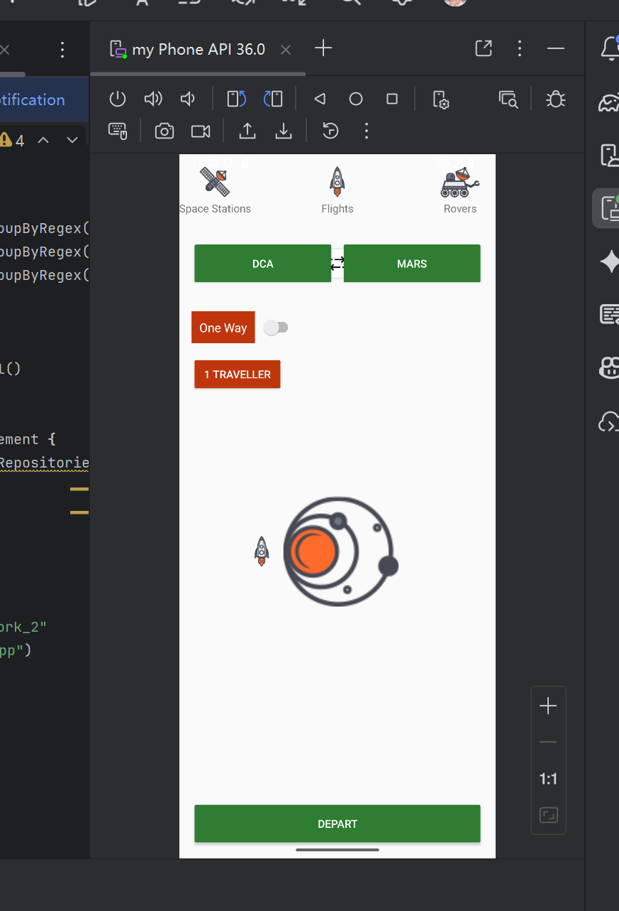

# Android布局设计学习报告

## 1. 引言

本报告旨在总结Android应用布局设计的学习过程，通过实践项目掌握Android布局系统的核心概念和使用方法。本次学习以一个简单的太空主题应用为例，重点学习了ConstraintLayout和TableLayout两种常用布局方式。

## 2. 学习目标

- 理解Android布局系统的基本原理
- 掌握ConstraintLayout约束布局的核心概念和使用方法
- 学习TableLayout表格布局的设计技巧
- 了解Android界面组件的基本使用
- 熟悉Android项目的结构和配置

## 3. 项目背景

### 3.1 项目概述

本项目是一个简单的太空主题演示应用，主要展示不同布局方式的实现效果。项目采用Kotlin语言开发，使用Android Studio作为开发工具。

### 3.2 技术栈

- **开发语言**：Kotlin
- **开发工具**：Android Studio
- **目标SDK**：36
- **最低SDK**：24
- **主要布局**：ConstraintLayout、TableLayout
- **核心依赖**：
  - AndroidX AppCompat
  - ConstraintLayout 2.1.4

## 4. 学习过程

### 4.1 项目结构分析

项目采用标准Android项目结构，主要文件组织如下：

```
app/src/main/
├── java/com/lzg/homework_2/
│   ├── MainActivity.kt         # 主活动类
│   └── ui/theme/               # 主题相关文件
└── res/
    ├── drawable/               # 图片资源
    ├── layout/                 # 布局文件
    │   ├── activity_main.xml          # 默认布局
    │   ├── constraint_layout.xml      # 约束布局示例
    │   ├── img_constraint_latout.xml  # 带图片的约束布局
    │   └── table_layout.xml           # 表格布局示例
    └── values/                 # 资源值文件
```

### 4.2 布局设计学习

#### 4.2.1 ConstraintLayout约束布局

约束布局是Android中最灵活的布局方式，通过约束条件确定组件位置。本项目中的`img_constraint_latout.xml`展示了约束布局的核心用法：

- **组件定位**：使用`app:layout_constraintStart_toStartOf`、`app:layout_constraintTop_toTopOf`等属性设置组件间的约束关系
- **等宽分配**：通过`app:layout_constraintHorizontal_weight`实现按钮的等宽分布
- **相对定位**：利用组件ID建立相对位置关系

```xml
<!-- 左侧绿色按钮 DCA -->
<Button
    android:id="@+id/btndca"
    android:layout_width="0dp"
    android:layout_height="60dp"
    android:backgroundTint="#2E7D32"
    android:text="DCA"
    android:textColor="#FFFFFF"
    app:layout_constraintTop_toBottomOf="@id/text1"
    app:layout_constraintStart_toStartOf="parent"
    app:layout_constraintEnd_toStartOf="@id/btnmars"
    android:layout_marginTop="32dp"
    android:layout_marginStart="16dp"
    android:layout_marginEnd="4dp"
    app:layout_constraintHorizontal_weight="1" />
```

#### 4.2.2 TableLayout表格布局

表格布局适合展示结构化数据，本项目中的`table_layout.xml`实现了类似菜单的界面：

- **行组织**：使用`<TableRow>`标签定义表格行
- **列合并**：通过`android:layout_span`属性实现列合并
- **分隔线**：使用`<View>`标签添加视觉分隔线
- **内容对齐**：设置文本对齐方式和权重分配

### 4.3 界面组件使用

项目中使用了多种Android基础组件：

- **ImageView**：显示太空主题图标
- **TextView**：展示文本内容
- **Button**：实现交互功能
- **View**：作为视觉分隔线

### 4.4 项目运行效果

以下是项目运行时的界面截图：



## 5. 技术收获

### 5.1 布局技术

- **ConstraintLayout**：掌握了约束布局的核心概念，能够使用约束条件精确定位界面元素，实现复杂的响应式布局
- **TableLayout**：学会了使用表格布局组织结构化内容，了解其适用场景和设计技巧
- **布局切换**：掌握了在MainActivity中动态切换不同布局的方法

### 5.2 项目配置

- **Gradle配置**：了解了Android项目的Gradle配置文件结构，包括依赖管理、构建类型配置等
- **资源管理**：熟悉了Android资源的组织方式，包括图片资源、布局文件、字符串资源等
- **版本控制**：了解了Android版本兼容的基本概念，包括compileSdk、minSdk、targetSdk的配置

## 6. 问题与解决

### 6.1 布局适配问题

**问题**：在不同屏幕尺寸上，组件的相对位置和大小可能出现不一致

**解决**：使用约束布局的约束条件和权重分配，避免硬编码尺寸，确保界面在不同设备上的一致性

### 6.2 组件间距调整

**问题**：组件之间的间距设置不合理，导致界面美观度下降

**解决**：使用`android:layout_margin`和`android:layout_padding`属性，结合视觉设计原则调整组件间距

## 7. 反思总结

### 7.1 学习成果

通过本次学习，我系统掌握了Android布局设计的核心知识，能够独立实现基本的界面布局。特别是对ConstraintLayout的学习，为后续开发复杂界面奠定了基础。

### 7.2 学习体会

1. **布局选择**：不同布局方式有其适用场景，应根据界面需求选择合适的布局方式
2. **组件化设计**：良好的界面设计应考虑组件的复用性和可维护性
3. **响应式设计**：应始终考虑不同屏幕尺寸和方向的适配问题
4. **实践出真知**：通过实际项目练习，能够更深刻地理解和掌握布局概念

### 7.3 未来展望

在未来的学习中，我将继续深入学习Android界面设计，包括：

- 学习RecyclerView等高级列表组件的使用
- 掌握Material Design设计规范
- 学习Jetpack Compose现代UI框架
- 提高界面的用户体验和交互设计能力

## 8. 结论

本次Android布局设计学习通过实践项目的方式，系统学习了ConstraintLayout和TableLayout等核心布局技术，掌握了Android界面设计的基本原理和方法。学习过程中遇到的问题和解决方案为后续学习积累了宝贵经验，也为进一步深入Android开发奠定了基础。