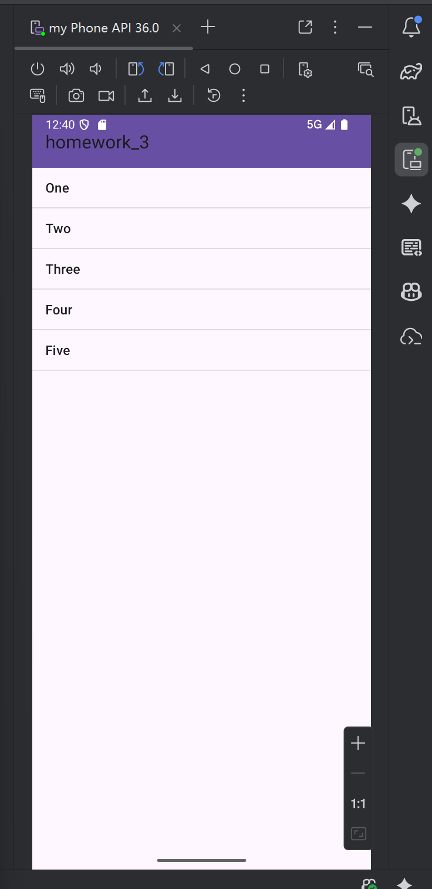

# Android Homework 3 学习报告

## 引言
本次Android作业（homework_3）主要涉及Android应用开发中的列表视图、菜单系统和交互模式等核心组件的学习与实践。通过本次作业，我系统掌握了Android中ListView、自定义对话框、通知机制、选项菜单以及ActionMode等重要功能的实现方法。

## 学习目标
1. 掌握ListView控件的基本使用和自定义适配器
2. 学习自定义对话框的创建和使用
3. 理解Android通知机制的实现
4. 掌握XML菜单的创建和处理
5. 学习ActionMode多选模式的实现

## 项目背景
本项目是Android开发学习的第三次作业，主要围绕Android应用的交互界面设计和用户体验优化展开。项目包含三个主要功能模块：动物列表展示、自定义登录对话框和菜单系统，旨在通过实践加深对Android核心组件的理解和应用。

## 学习过程

### 1. 项目结构分析
项目采用标准的Android应用架构，主要包含以下核心文件：

- **Activity文件**：
  - `MainActivity.java`：主入口，包含动物列表和登录对话框功能
  - `MenuXmlActivity.java`：XML菜单系统实现
  - `ActionModeActivity.java`：ActionMode多选模式实现

- **布局文件**：
  - `activity_main.xml`：主界面布局
  - `activity_menu_test.xml`：菜单测试界面
  - `activity_action_mode.xml`：ActionMode界面
  - `list_item.xml`：列表项布局
  - `login_dialog.xml`：登录对话框布局

- **菜单文件**：
  - `main_menu.xml`：选项菜单定义
  - `context_menu.xml`：上下文菜单定义

### 2. 核心功能实现

#### 2.1 动物列表展示
```java
private void initAnimalList() {
    ListView listView = findViewById(R.id.listView);

    List<Map<String, Object>> data = new ArrayList<>();
    for (int i = 0; i < names.length; i++) {
        Map<String, Object> item = new HashMap<>();
        item.put("image", images[i]);
        item.put("name", names[i]);
        data.add(item);
    }

    SimpleAdapter adapter = new SimpleAdapter(
            this,
            data,
            R.layout.list_item,
            new String[]{"image", "name"},
            new int[]{R.id.animal_image, R.id.animal_name}
    );

    listView.setAdapter(adapter);

    listView.setOnItemClickListener((parent, view, position, id) -> {
        String selected = names[position];
        Toast.makeText(MainActivity.this, "You selected: " + selected, Toast.LENGTH_SHORT).show();
        sendNotification(selected);
    });
}
```

#### 2.2 自定义登录对话框
```java
private void showLoginDialog() {
    LayoutInflater inflater = LayoutInflater.from(this);
    View dialogView = inflater.inflate(R.layout.login_dialog, null);

    EditText etUsername = dialogView.findViewById(R.id.etUsername);
    EditText etPassword = dialogView.findViewById(R.id.etPassword);

    AlertDialog.Builder builder = new AlertDialog.Builder(this);
    builder.setView(dialogView)
            .setTitle("ANDROID APP")
            .setPositiveButton("Sign in", (dialog, which) -> {
                // 登录逻辑处理
            });
}
```

#### 2.3 ActionMode多选模式
```java
listView.setMultiChoiceModeListener(new AbsListView.MultiChoiceModeListener() {
    @Override
    public void onItemCheckedStateChanged(ActionMode mode, int position, long id, boolean checked) {
        mode.setTitle(listView.getCheckedItemCount() + " selected");
    }

    @Override
    public boolean onCreateActionMode(ActionMode mode, Menu menu) {
        getMenuInflater().inflate(R.menu.context_menu, menu);
        return true;
    }

    @Override
    public boolean onActionItemClicked(ActionMode mode, MenuItem item) {
        if (item.getItemId() == R.id.delete) {
            Toast.makeText(ActionModeActivity.this, "Delete clicked", Toast.LENGTH_SHORT).show();
            mode.finish();
        }
        return true;
    }
});
```

## 技术收获

### 1. ListView与适配器模式
- 掌握了ListView的基本使用方法，包括数据绑定和点击事件处理
- 学习了SimpleAdapter的使用，实现了图文混排的列表项
- 理解了适配器模式在Android UI开发中的重要性

### 2. 对话框系统
- 学会了自定义对话框的创建，通过LayoutInflater加载自定义布局
- 掌握了AlertDialog.Builder的使用，实现了各种对话框样式
- 理解了对话框的生命周期和事件处理机制

### 3. 通知机制
- 学习了NotificationChannel的创建和配置
- 掌握了NotificationCompat.Builder的使用，实现了通知的发送
- 理解了Android通知系统的工作原理

### 4. 菜单系统
- 学会了使用XML文件定义选项菜单和上下文菜单
- 掌握了onCreateOptionsMenu和onOptionsItemSelected方法的使用
- 理解了菜单的层级结构和事件处理

### 5. ActionMode多选模式
- 学习了AbsListView.MultiChoiceModeListener接口的使用
- 掌握了ActionMode的创建和管理
- 理解了多选模式下的用户交互流程

## 问题与解决

### 问题1：ListView点击事件不响应
**解决方案**：检查ListView的适配器设置是否正确，确保setAdapter方法被正确调用，并且列表项的点击事件监听器被正确设置。

### 问题2：自定义对话框布局显示异常
**解决方案**：在创建自定义对话框时，确保正确使用LayoutInflater加载布局，并通过builder.setView()方法设置对话框内容视图。

### 问题3：通知不显示
**解决方案**：在Android 8.0及以上版本，必须创建NotificationChannel并将其与通知关联，否则通知将无法显示。

## 实践成果展示

### ActionMode多选模式界面



## 反思总结

通过本次Android作业的学习与实践，我系统掌握了Android应用开发中的多个核心组件和功能。在实践过程中，我深刻体会到了Android开发的以下特点：

1. **组件化设计**：Android采用组件化的设计思想，各个组件之间通过Intent进行通信，这种设计使得应用具有良好的模块化和可扩展性。

2. **用户体验优先**：Android提供了丰富的UI组件和交互模式，如ListView、ActionMode等，这些组件都是为了提升用户体验而设计的。

3. **版本兼容性**：Android版本众多，在开发过程中需要考虑不同版本之间的兼容性问题，如通知机制在Android 8.0及以上版本的变化。

4. **XML与Java结合**：Android开发采用XML定义界面，Java处理逻辑的方式，这种分离使得界面设计和逻辑处理更加清晰。

通过本次作业，我不仅掌握了Android开发的相关技术，还培养了独立解决问题的能力和良好的编程习惯。在未来的学习中，我将继续深入学习Android开发的高级特性，如RecyclerView、Fragment、网络请求等，不断提升自己的Android开发水平。

## 未来规划
1. 学习RecyclerView的使用，替代传统的ListView
2. 掌握Fragment的使用，实现更灵活的界面布局
3. 学习网络请求框架的使用，如Retrofit和OkHttp
4. 理解Android的生命周期和内存管理机制
5. 学习Material Design设计规范，提升应用的视觉效果